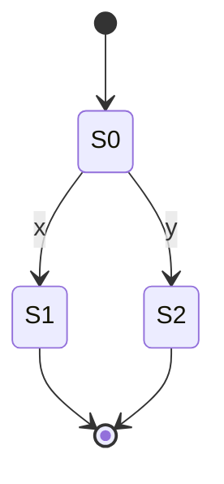

## FSM 1: No Branching

This is the first finite state machine showing a transition from start to state S0, then to S1 on input 'a', and finally ending.

## FSM 2: Branching States

This is the final text.